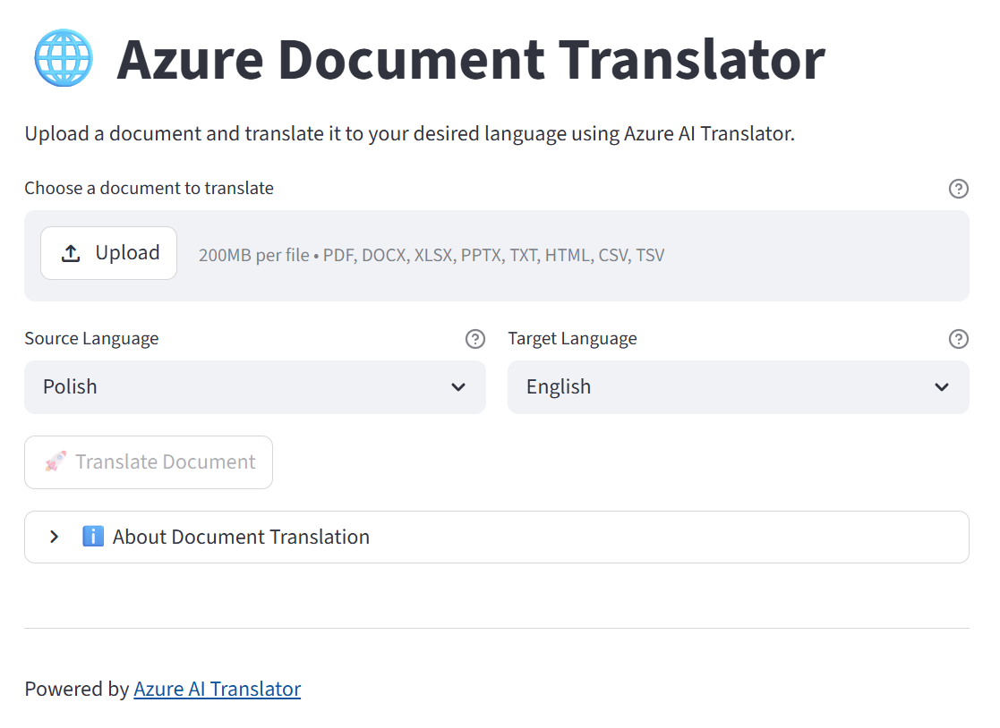

# Document Translator

A Streamlit web application for translating documents using Azure AI Translator and Azure Blob Storage with Entra ID authentication.

## Features

- **Document Translation**: Translate entire documents while preserving formatting
- **Multiple File Formats**: Supports PDF, DOCX, XLSX, PPTX, TXT, HTML, CSV, and TSV
- **20+ Languages**: Translate between English, Polish, German, French, Spanish, Italian, Japanese, Chinese, Korean, Arabic, and more
- **Secure Authentication**: Uses Azure Entra ID (DefaultAzureCredential) - no API keys or SAS tokens required
- **Simple UI**: Clean Streamlit interface with progress tracking

## Screenshot



## Prerequisites

- Python 3.8+
- Azure subscription with:
  - **Azure Translator** resource (Cognitive Services)
  - **Azure Storage Account** with two blob containers
- Azure CLI installed and logged in (`az login`)

## Required Azure RBAC Roles

| Resource | Role |
|----------|------|
| Storage Account | Storage Blob Data Contributor |
| Translator Resource | Cognitive Services User |

## Installation

1. Clone the repository:
   ```bash
   git clone https://github.com/aganiezgoda/doctranslator.git
   cd doctranslator
   ```

2. Create and activate a virtual environment:
   ```bash
   python -m venv .venv
   .venv\Scripts\activate  # Windows
   # or
   source .venv/bin/activate  # Linux/macOS
   ```

3. Install dependencies:
   ```bash
   pip install -r requirements.txt
   ```

4. Create a `.env` file with your Azure configuration:
   ```env
   TRANSLATOR_ENDPOINT=https://<your-translator>.cognitiveservices.azure.com/
   STORAGE_ACCOUNT_URL=https://<your-storage>.blob.core.windows.net
   INPUT_CONTAINER=doctranslatorinput
   OUTPUT_CONTAINER=doctranslatoroutput
   ```

5. Log in to Azure CLI:
   ```bash
   az login
   ```

## Usage

Run the Streamlit application:

```bash
streamlit run app.py
```

Then:
1. Upload a document
2. Select source and target languages
3. Click "Translate Document"
4. Download the translated file

## Supported Languages

| Language | Code |
|----------|------|
| English | en |
| Polish | pl |
| German | de |
| French | fr |
| Spanish | es |
| Italian | it |
| Portuguese | pt |
| Dutch | nl |
| Norwegian (Bokmål) | nb |
| Swedish | sv |
| Danish | da |
| Finnish | fi |
| Russian | ru |
| Ukrainian | uk |
| Czech | cs |
| Japanese | ja |
| Chinese (Simplified) | zh-Hans |
| Chinese (Traditional) | zh-Hant |
| Korean | ko |
| Arabic | ar |
| Hindi | hi |

## Architecture

```
┌─────────────┐     ┌──────────────────┐     ┌─────────────────┐
│  Streamlit  │────▶│  Azure Blob      │────▶│ Azure Translator│
│  Web App    │◀────│  Storage         │◀────│ (Document API)  │
└─────────────┘     └──────────────────┘     └─────────────────┘
       │                    │                        │
       └────────────────────┴────────────────────────┘
                    Entra ID Authentication
```

## Authentication

The application uses `DefaultAzureCredential` which supports:
- **Local development**: Azure CLI credentials (`az login`)
- **Azure deployment**: Managed Identity
- **CI/CD**: Service Principal with environment variables

## License

MIT
